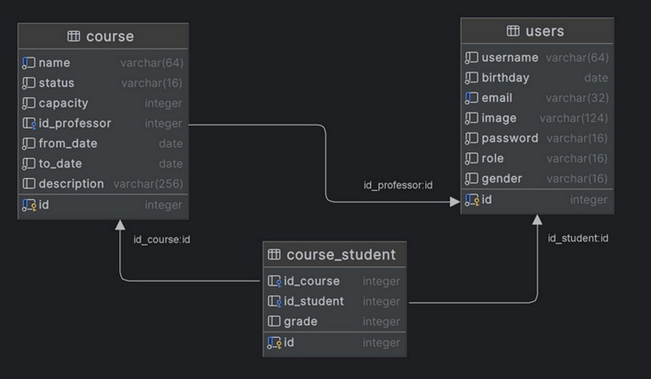
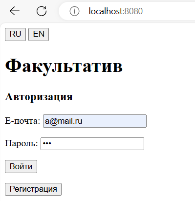
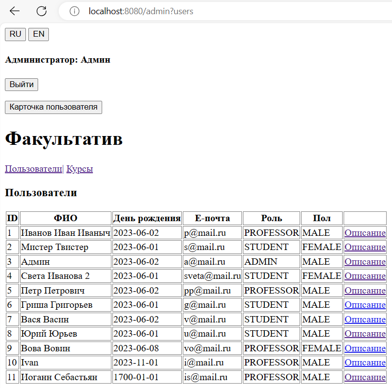
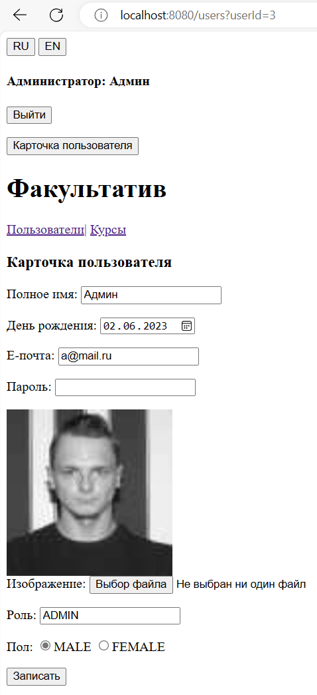
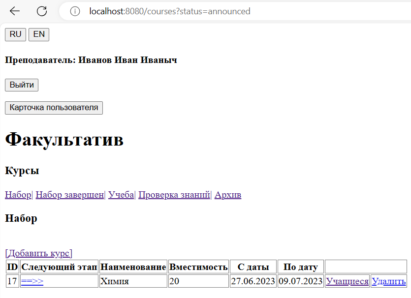
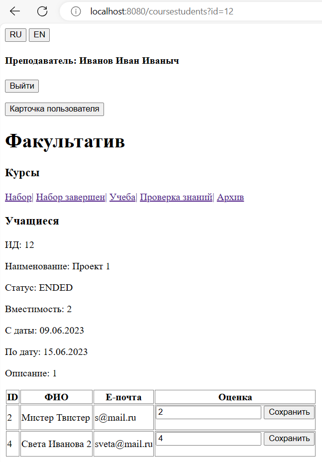
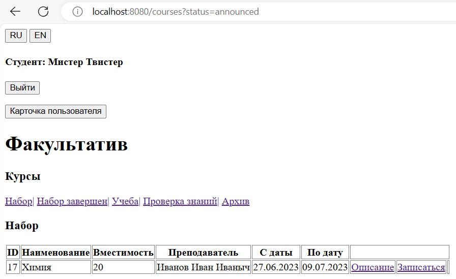

# Open classroom

In this project, teachers can add additional training courses and students can sign up 
to take them. At the end of the faculty, the teacher evaluates the student’s work and the results are stored in the archive.
Each training course can be in one of the states:\
ANNOUNCED - the course has been announced and students can enroll in a group;\
WAITING - groups of students have been formed and are awaiting the start of classes;\
LEARNING - the learning process is underway;\
ENDED - the course is completed, grades are being assigned;\
ARCHIVED - learning results are saved in the archive.

Each user can have one of the roles: ADMIN, PROFESSOR, STUDENT.
The application has localization configured for English and Russian.
In the application you can upload images for users.

Class diagram

### <u>Run guide:</u>

To build the project: *.\mvnw clean install*\
To execute the app: *docker-compose up -d*\
Type in your browser: http://localhost:8080

#### Admin by default:

* login: a@mail.ru
* password: 123

#### File <u>application.properties</u>:
db.url=${database.url}\
db.user=postgres\
db.password=post\
db.driver=org.postgresql.Driver\
db.pool.size=5\
db.fetch-size=100\
db.timeout=10\
db.max-rows=200\
image.base.url=./foto

### <u>Technology stack:</u>

* Java: JDK 17
* Build: Maven
* DB: Postgres
* Web server: Apache Tomcat
* Front: JSP
* Library: Lombok, Servlet API 
* Containers: Docker, docker-compose

Application view

---

---

---

---

---

